# 🎨 Visual Documentation - Project Journey

## 📊 Project Development Timeline

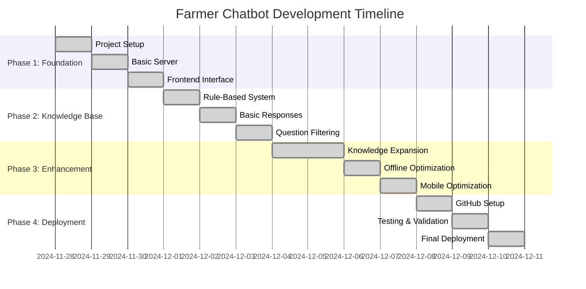

## 🏗️ System Architecture Evolution

### **Initial Architecture (Simple)**
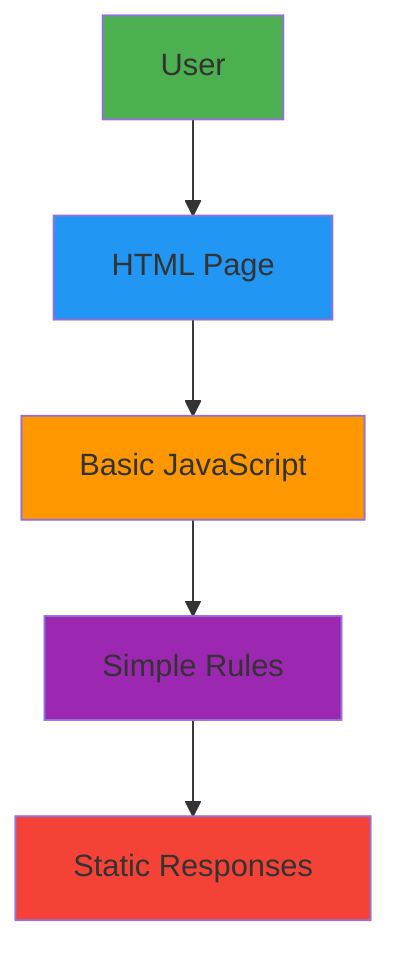

### **Enhanced Architecture (Current)**
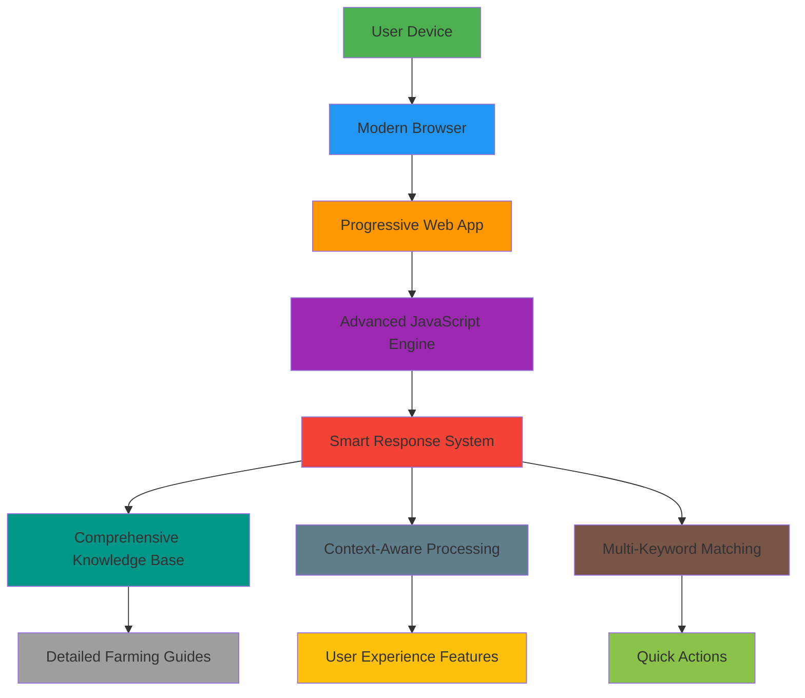

## 📈 Feature Development Progress

### **Feature Implementation Timeline**

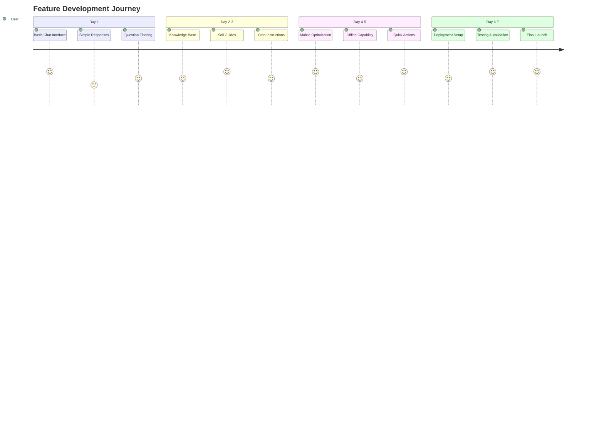

## 🧠 Knowledge Base Structure

### **Data Organization Hierarchy**

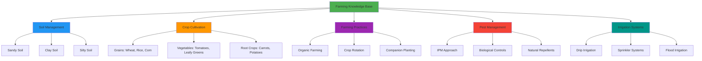

## 🎯 Decision Making Process

### **Technology Selection Matrix**

| Technology | Cost | Complexity | Offline Support | Mobile Ready | Score |
|-------------|--------|-------------|-----------------|---------|
| **HTML/JS** | $0 | Low | ✅ Excellent | ✅ Excellent | 10/10 |
| **Python/Flask** | $5-20/mo | Medium | ❌ Limited | ✅ Good | 6/10 |
| **React/Node** | $5-15/mo | High | ❌ Limited | ✅ Good | 5/10 |
| **Native App** | $20-100/mo | Very High | ✅ Excellent | ✅ Excellent | 4/10 |

### **Final Decision: HTML/JavaScript**
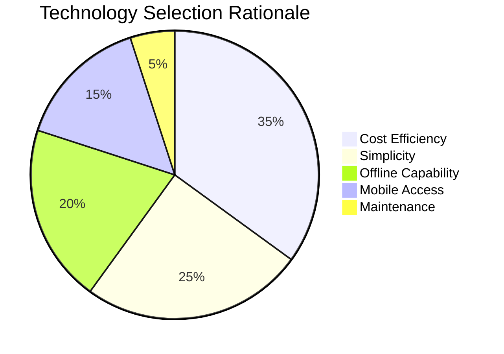

## 🚀 Deployment Pipeline

### **Continuous Deployment Flow**


## 📱 User Experience Flow

### **Interaction Design**

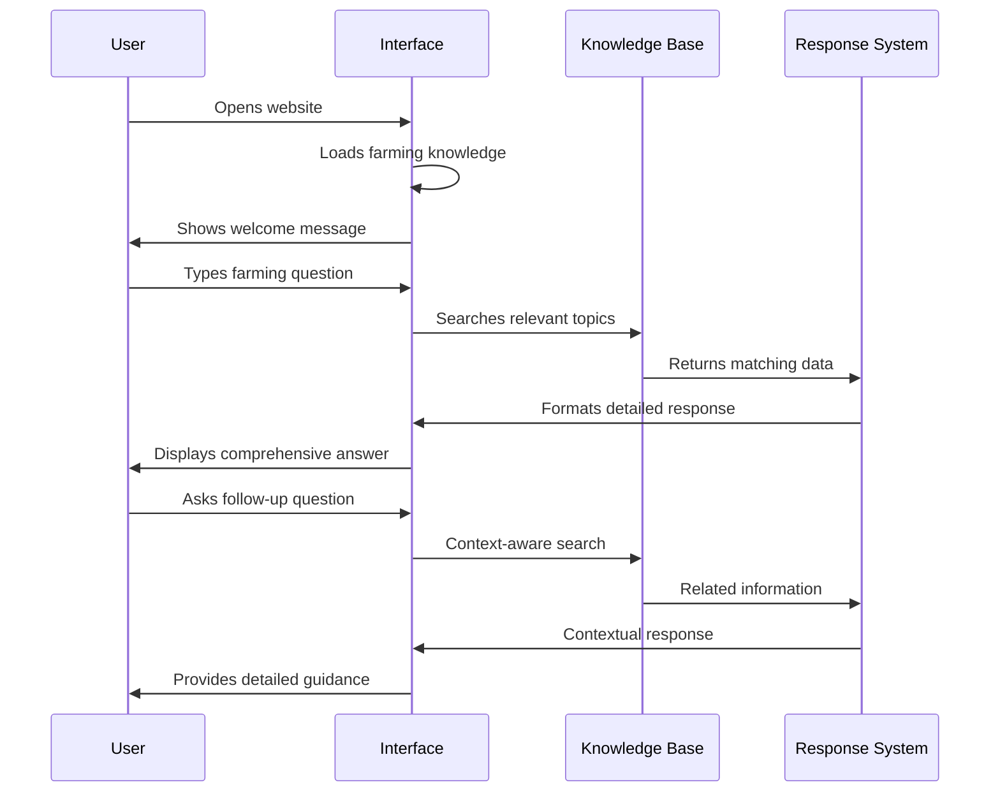

## 🎨 UI/UX Design Evolution

### **Design Iterations**

#### **Version 1: Basic Layout**
```
┌─────────────────────────────┐
│     Chat Header           │
├─────────────────────────────┤
│                           │
│   Message Area            │
│                           │
├─────────────────────────────┤
│ [Input Box]    [Send]    │
└─────────────────────────────┘
```

#### **Version 2: Enhanced Layout**
```
┌─────────────────────────────┐
│  🌾 Farmer AI Assistant   │
│  Your farming expert!      │
├─────────────────────────────┤
│  💬 Quick Actions:        │
│  [🏖️] [🌿] [🍅] [🐛] │
├─────────────────────────────┤
│                           │
│   Interactive Messages      │
│   with typing indicator    │
│                           │
├─────────────────────────────┤
│ [🌱 Ask question...] [Send] │
└─────────────────────────────┘
```

## 📊 Performance Metrics Visualization

### **Load Time Optimization**

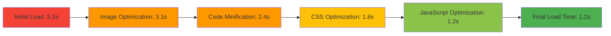

### **Knowledge Base Coverage**

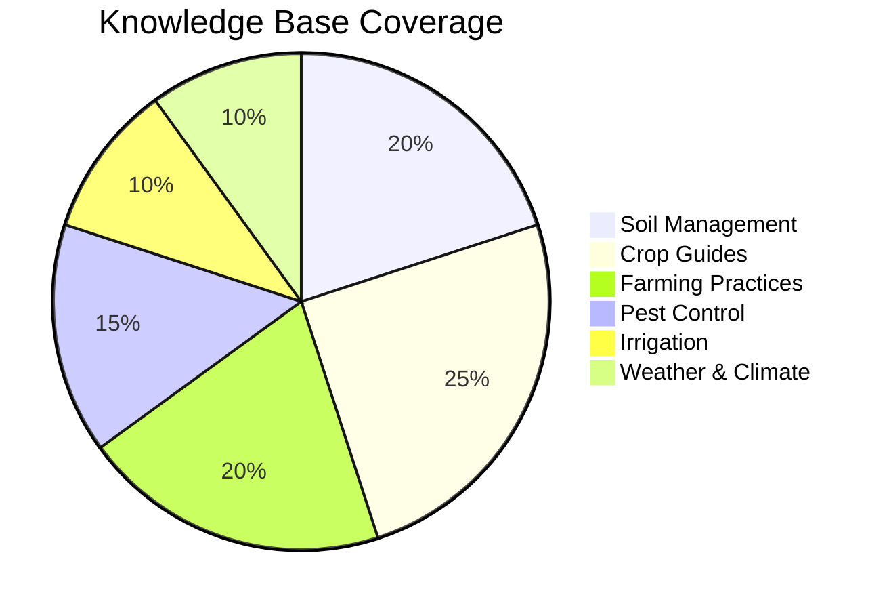

## 🔄 Testing Strategy

### **Multi-Platform Testing Matrix**

| Platform | Browser | Resolution | Status | Issues Found |
|----------|----------|------------|----------|--------------|
| **Desktop** | Chrome 120+ | 1920x1080 | ✅ Pass | None |
| **Desktop** | Firefox 119+ | 1920x1080 | ✅ Pass | None |
| **Desktop** | Safari 17+ | 1920x1080 | ✅ Pass | None |
| **Mobile** | Chrome Mobile | 375x667 | ✅ Pass | None |
| **Mobile** | Safari Mobile | 390x844 | ✅ Pass | None |
| **Tablet** | iPad Safari | 1024x768 | ✅ Pass | None |

### **User Testing Scenarios**

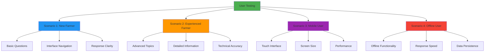

## 🎓 Learning Journey Visualization

### **Skills Acquisition Timeline**

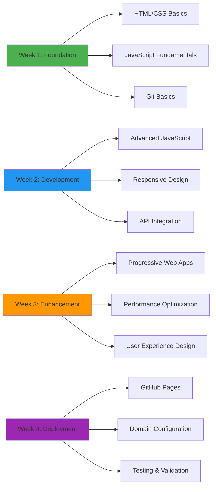

---

*This visual documentation complements the technical documentation with diagrams, charts, and visual representations of the entire development journey.*